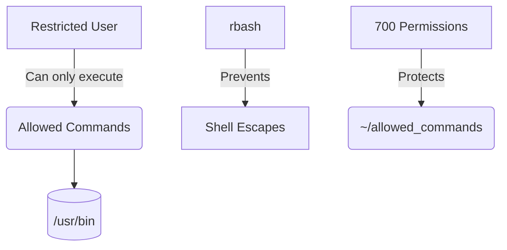

# User System Restriction Tool


A security-focused tool to create and manage restricted user accounts with controlled command access.

## Table of Contents
- [Features](#features)
- [Requirements](#requirements)
- [Installation](#installation)
- [Usage](#usage)
  - [createuser.sh](#createusersh)
  - [updateuser.sh](#updateusersh)
- [Security Model](#security-model)
- [Examples](#examples)
- [Best Practices](#best-practices)
- [Limitations](#limitations)
- [License](#license)

## Features

✔ Creates users with restricted bash shell (rbash)  
✔ Limits users to explicitly allowed commands  
✔ Interactive command management  
✔ Secure directory structure  
✔ Command validation  
✔ Permission hardening  

## Requirements

- Linux system (tested on Ubuntu/Debian)
- Bash 4.0+
- Sudo privileges
- Standard utilities: `adduser`, `chsh`, `ln`

## Installation

```bash
git clone https://github.com/yourusername/User-System-Restriction.git
cd User-System-Restriction
chmod +x createuser.sh updateuser.sh
## Usage

### createuser.sh

Creates a new restricted user account.

**Syntax:**
```bash
sudo ./createuser.sh USERNAME COMMAND1 [COMMAND2...]
```

**Implementation Details:**
1. Creates user with disabled password
2. Sets shell to `/bin/rbash`
3. Creates `~/allowed_commands` directory
4. Adds symlinks to allowed commands
5. Locks down permissions (chmod 700)

### updateuser.sh

Modifies command access for existing users.

**Syntax:**
```bash
sudo ./updateuser.sh USERNAME COMMAND1 [COMMAND2...]
```

**Features:**
- Checks command validity in `/usr/bin/`
- Interactive overwrite prompts
- Graceful error handling
- Atomic operations

## Security Model



## Examples

**Create a developer account:**
```bash
sudo ./createuser.sh dev nano ls grep git
```

**Add debugging tools later:**
```bash
sudo ./updateuser.sh dev tail less curl
```

**Verify setup:**
```bash
ls -la /home/dev/allowed_commands
```

## Best Practices

1. **Minimal Permissions**: Only allow essential commands
2. **Regular Audits**: Review allowed commands periodically
3. **Combine with**: 
   - Filesystem ACLs
   - SELinux/AppArmor
   - Network restrictions